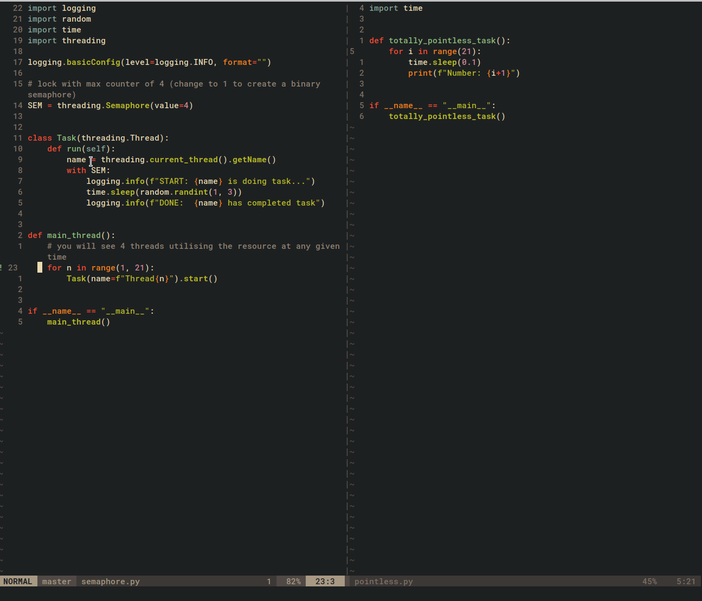

# Run With Me

A simple script runner plugin with a pompous name.

Runs the current buffers code in a terminal beneath your current window.



## Installation

In your vimrc file;

```vim
Plug 'superDross/run-with-me.vim'
```


## Execution

Execute `:RunCode` to run your code in a terminal.

Alternatively, you can map the command to a key. Place the below snippet into your vimrc to map the command to Leader 9:

```vim
nmap <silent> <leader>9 <Plug>(run_code)
```


## Configuration

All the below examples are the global variables default values.

Change row size of the terminal output:

```vim
let g:runner_rowsize = 15
```

Use a different command other than the filetype:

```vim
" e.g. if filetype is javascript run script with node command
let g:runner_cmds = {
\    'javascript.jsx': 'node',
\    'javascript': 'node',
\    'vim': 'vim -N -u NONE -n -c "set nomore" -S'
\ }
```
